# 🎵 Spotify Data Analysis with PostgreSQL

This project is a comprehensive SQL-based data analysis of Spotify music streaming data. Using PostgreSQL, we set up a database from raw CSV data and answered a variety of business-relevant questions to gain insights into track performance, audience behavior, and platform trends.

## 📂 Table of Contents

- [🎵 Project Overview](#-spotify-data-analysis-with-postgresql)
- [🌟 Why This Project Is Important](#-why-this-project-is-important)
- [📊 Dataset](#-dataset)
- [🔧 Tools Used](#-tools-used)
- [🔄 Database Setup](#-database-setup)
- [📈 Business Questions & Insights](#-business-questions--insights)
  - [Q1. Tracks with over 1B Streams](#-q1-retrieve-the-names-of-all-tracks-that-have-more-than-1-billion-streams)
  - [Q2. Total Comments on Licensed Tracks](#-q2-get-the-total-number-of-comments-where-tracks-are-licensed)
  - [Q3. Albums and Artists](#-q3-list-all-albums-along-with-their-respective-artists)
  - [Q4. Single Album Tracks](#-q4-find-all-tracks-that-belong-to-the-album-type-single)
  - [Q5. Track Count per Artist](#-q5-count-the-total-number-of-tracks-by-each-artist)
  - [Q6. Average Danceability per Album](#-q6-calculate-the-average-danceability-of-tracks-in-each-album)
  - [Q7. Top 5 Energetic Tracks](#-q7-find-the-top-5-tracks-with-the-highest-energy-levels)
  - [Q8. Views and Likes of Official Videos](#-q8-list-all-tracks-along-with-their-views-and-likes-with-an-existing-official-video)
  - [Q9. Total Views per Album](#-q9-for-each-album-calculate-the-total-views-of-all-associated-tracks)
  - [Q10. Spotify > YouTube Streams](#-q10-retrieve-the-track-names-that-have-been-streamed-on-spotify-more-than-youtube)
  - [Q11. Top 3 Most-Viewed Tracks per Artist](#-q11-find-the-top-three-most-viewed-tracks-for-each-artist)
  - [Q12. Above Average Liveness](#-q12-write-a-query-to-find-tracks-where-the-liveness-score-is-above-the-average)
  - [Q13. Energy Range per Album](#-q13-calculate-the-difference-between-the-highest-and-lowest-energy-values-for-tracks-in-each-album)
- [⭐️ Key Insights](#️-key-insights)
- [🧠 What I Have Learned](#-what-i-have-learned)
- [🙏 Acknowledgments](#-acknowledgments)
- [⚖️ License](#️-license)

---


## 🌟 Why This Project Is Important
This project showcases my ability to think like a Data Analyst by transforming raw Spotify data into structured insights using PostgreSQL. It demonstrates end-to-end analytical skills—from designing a database and writing meaningful queries to interpreting results and communicating insights clearly. By focusing on real-world business questions, the project highlights how data can support strategic decisions, making it a valuable piece in my data analytics portfolio.


## 📊 Dataset
- **Source**: Provided via `spotify.csv` from [Sanjana Chaudhari](https://www.kaggle.com/datasets/sanjanchaudhari/spotify-dataset)
- **Contents**: Information on tracks, albums, artists, views, likes, comments, danceability, energy, and streaming platforms (Spotify vs YouTube).


## 🔧 Tools Used
- PostgreSQL: Used to create and manage the relational database
- VSCode: Main development environment for writing SQL scripts and managing files
- pgAdmin: GUI client for executing SQL queries, managing tables, and inspecting results
- ChatGPT: For query optimization and insight helper


## 🔄 Database Setup
The database is set up in 3 steps:

1. `1_database_setup.sql` – Creates the database.
2. `2_table_setup.sql` – Defines tables and schemas.
3. `3_data_populate.sql` – Loads data from the CSV into the tables.

All SQL files are located in `sql_files/`.


## 📈 Business Questions & Insights
_*Each query is structured to solve a business question, followed by a code snippet, visual result, and interpretation.*_

### ✅ Q1. Retrieve the names of all tracks that have more than 1 billion streams.
```sql
SELECT 
   track, 
   stream
FROM spotify
WHERE stream > 1000000000
ORDER BY stream DESC;
```
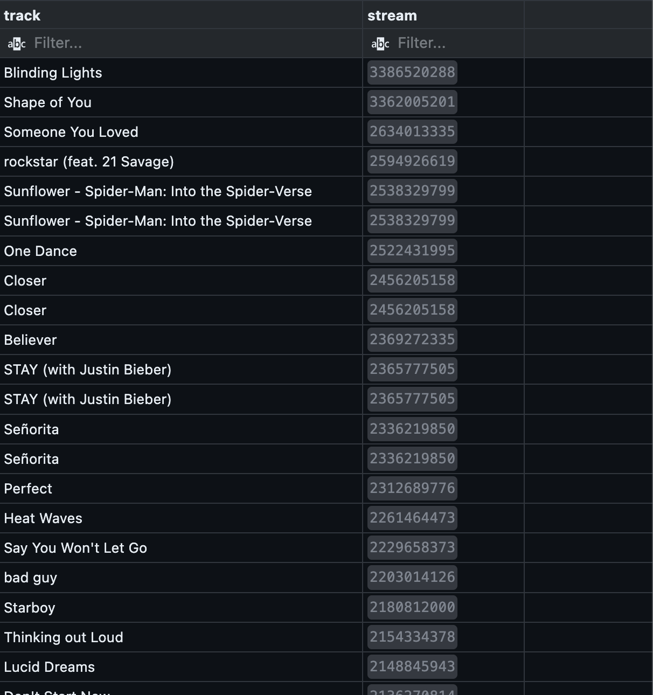
💡 **Insight**: Identifies globally popular tracks with massive reach on Spotify.

### ✅ Q2. Get the total number of comments where tracks are licensed.
```sql
SELECT SUM(comments) num_comments_with_licensed_being_true
FROM spotify
WHERE licensed = TRUE;
```
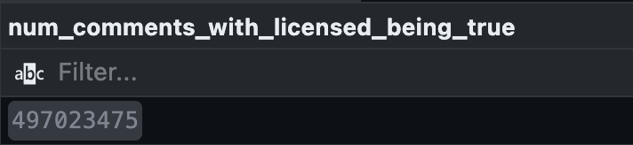
💡 **Insight**: Provides insights into user engagement (via comments) for officially licensed tracks.

### ✅ Q3. List all albums along with their respective artists.
```sql
SELECT
    album,
    artist
FROM spotify
GROUP BY 1, 2;
```
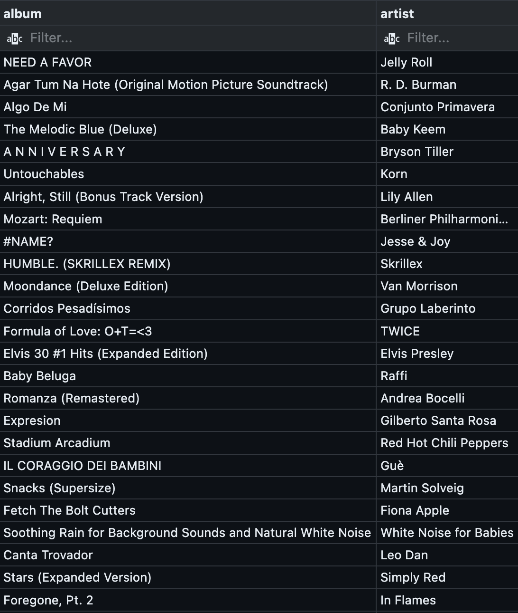
💡 **Insight**: Shows which artists are associated with each album, helpful for cataloging.

### ✅ Q4. Find all tracks that belong to the album type single.
```sql
SELECT track
FROM spotify
WHERE album_type = 'single';
```
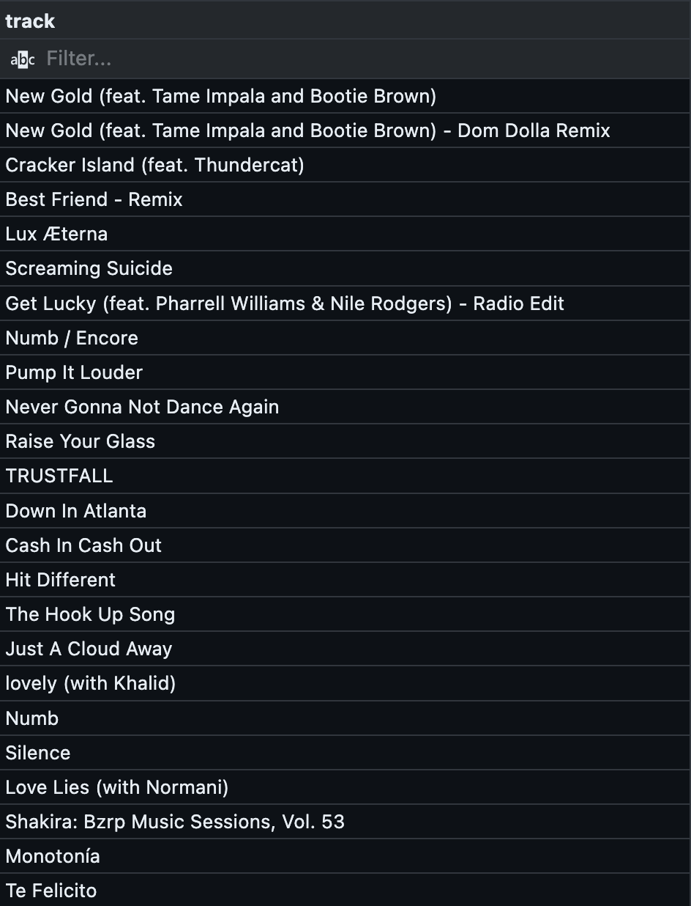
💡 **Insight**: Highlights tracks released as singles—often promotional or hit-focused.

### ✅ Q5. Count the total number of tracks by each artist.
```sql
SELECT
    artist,
    COUNT(track) total_tracks
FROM spotify
GROUP BY 1
ORDER BY 2 DESC;
```
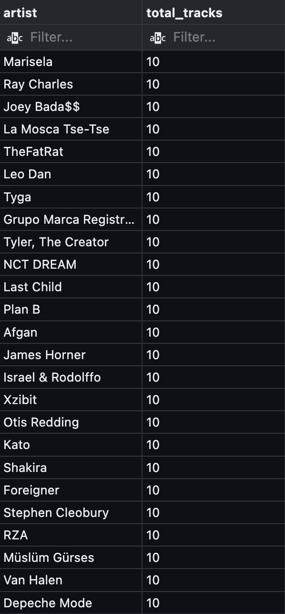
💡 **Insight**: Reveals the most prolific artists in the dataset.

### ✅ Q6. Calculate the average danceability of tracks in each album.
```sql
SELECT
    album,
    ROUND(AVG(danceablity)::NUMERIC, 2) avg_danceability
FROM spotify
GROUP BY 1
ORDER BY 2 DESC;
```
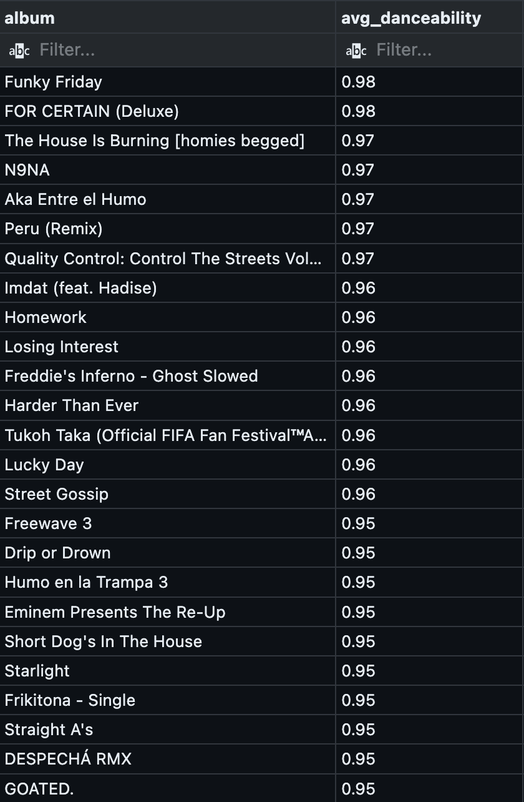
💡 **Insight**: Indicates how danceable albums are on average—useful for mood or genre classification.

### ✅ Q7. Find the top 5 tracks with the highest energy levels.
```sql
SELECT
    track,
    MAX(energy)
FROM spotify
GROUP BY 1
ORDER BY 2 DESC
LIMIT 5;
```
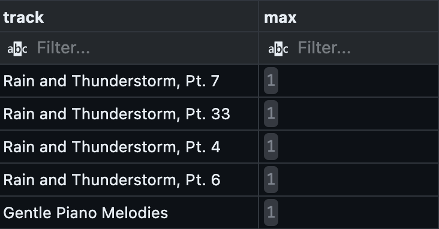
💡 **Insight**: Identifies the most energetic tracks, useful for workout or hype playlists.

### ✅ Q8. List all tracks along with their views and likes with an existing official video.
```sql
SELECT
    track,
    SUM(views) total_views,
    SUM(likes) total_likes
FROM spotify
WHERE official_video = TRUE
GROUP BY 1;
```
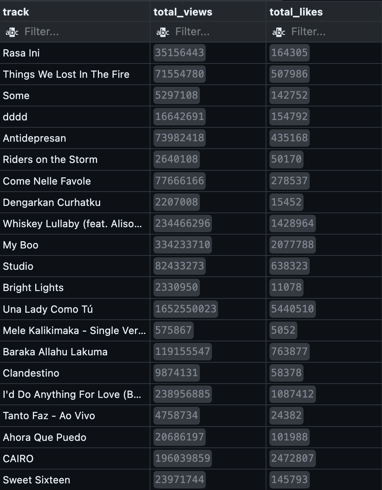
💡 **Insight**: Measures performance of tracks that also have official videos.

### ✅ Q9. For each album, calculate the total views of all associated tracks.
```sql
SELECT
    album,
    track,
    SUM(views) total_views
FROM spotify
GROUP BY 1, 2
ORDER BY 3 DESC;
```
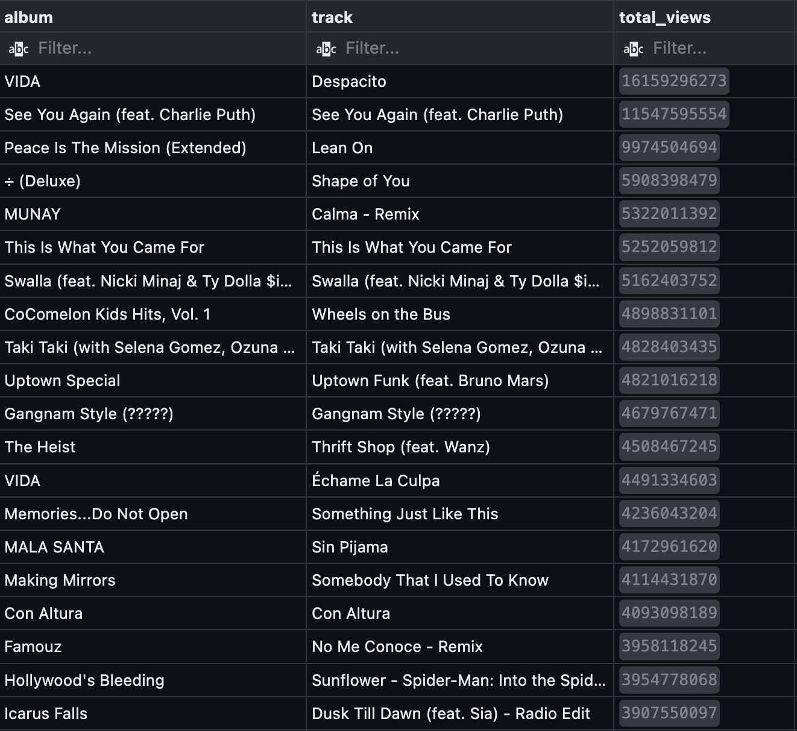
💡 **Insight**: Determines album popularity based on cumulative views.

### ✅ Q10. Retrieve the track names that have been streamed on Spotify more than Youtube.
```sql
WITH tracks_played_count AS (
        SELECT
            track,
            COALESCE(SUM(CASE WHEN most_played_on = 'Spotify' THEN stream END), 0) spotify_count,
            COALESCE(SUM(CASE WHEN most_played_on = 'YouTube' THEN stream END), 0) youtube_count 
        FROM spotify
        GROUP BY 1
)
SELECT
    track,
    spotify_count
FROM tracks_played_count
WHERE 
    spotify_count > youtube_count
```
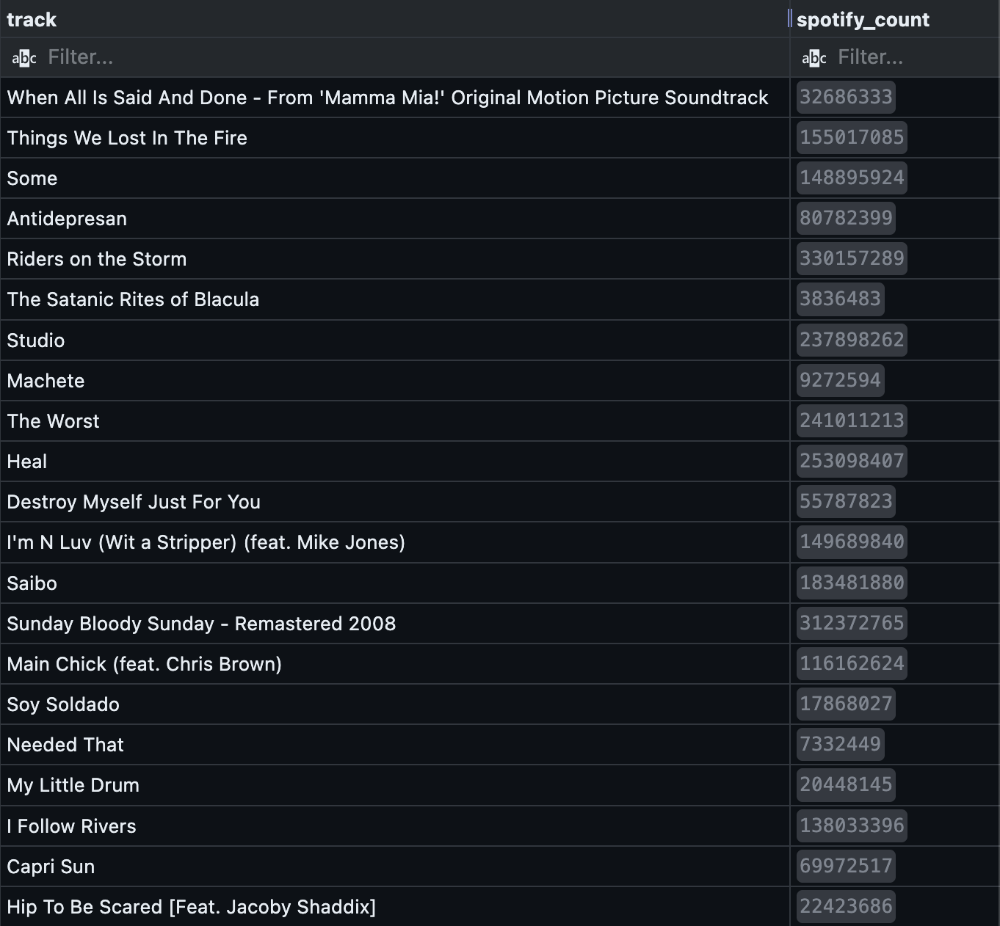
💡 **Insight**: Shows which tracks perform better on Spotify compared to YouTube.

### ✅ Q11. Find the top three most-viewed tracks for each artist.
```sql
WITH artist_ranking AS (
    SELECT
        artist,
        track,
        SUM(views) total_views,
        DENSE_RANK() OVER(PARTITION BY artist ORDER BY SUM(views) DESC) rank
    FROM spotify
    GROUP BY 1, 2
    ORDER BY 1, 3 DESC
)
SELECT *
FROM artist_ranking
WHERE rank <= 3;
```
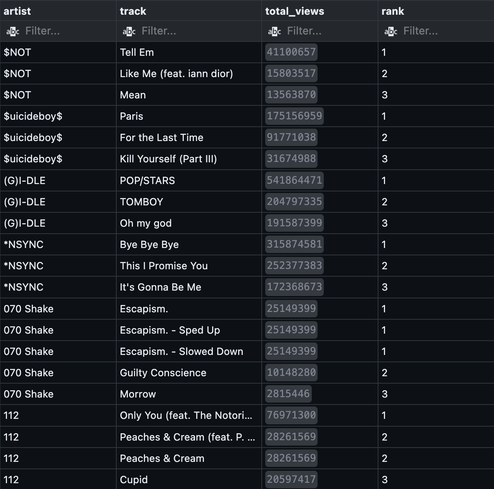
💡 **Insight**: Lists the most viewed tracks—key indicators of popularity.

### ✅ Q12. Write a query to find tracks where the liveness score is above the average.
```sql
SELECT
    track,
    artist,
    liveness
FROM spotify
WHERE liveness > (
    SELECT AVG(liveness)
    FROM spotify
)
```
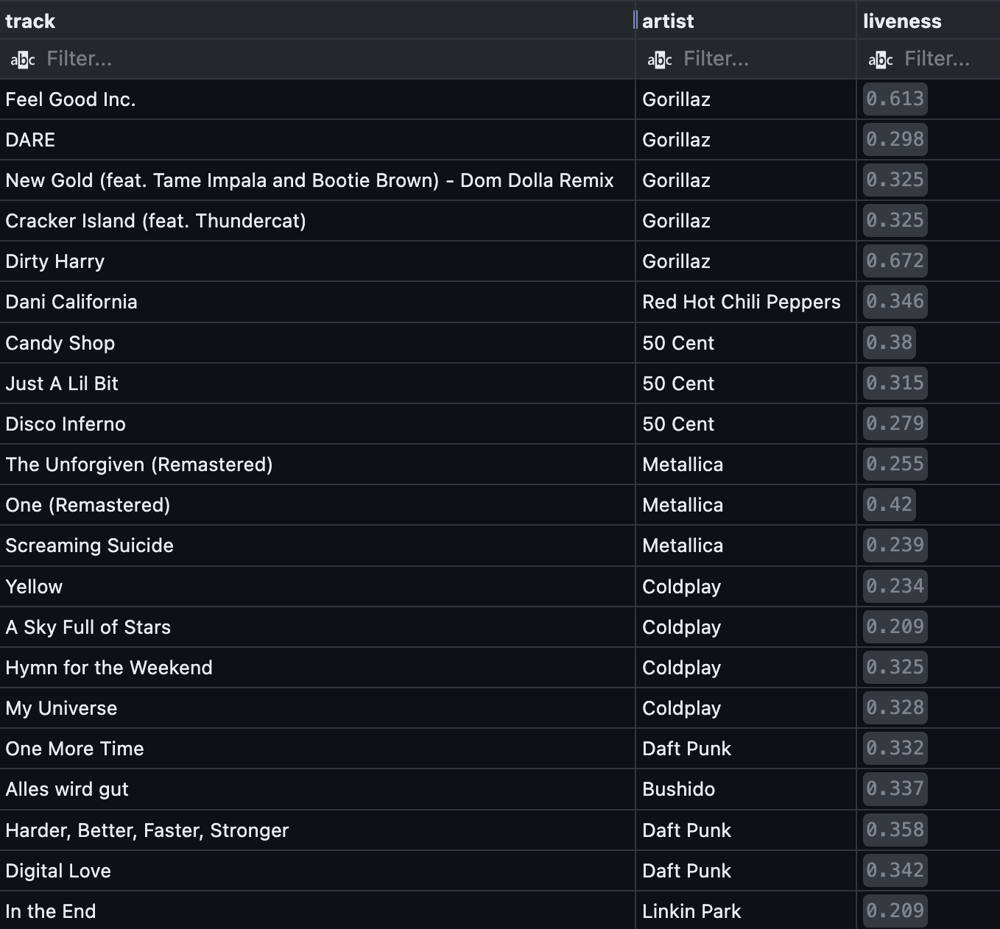
💡 **Insight**: Identifies tracks with a strong "live performance" vibe.

### ✅ Q13. Calculate the difference between the highest and lowest energy values for tracks in each album.
```sql
WITH album_max_low_energies AS (
    SELECT
        album,
        MAX(energy) highest_energy,
        MIN(energy) lowest_energy
    FROM spotify
    GROUP BY 1
)
SELECT
    album,
    highest_energy - lowest_energy energy_diff
FROM album_max_low_energies
ORDER BY 2 DESC;
```
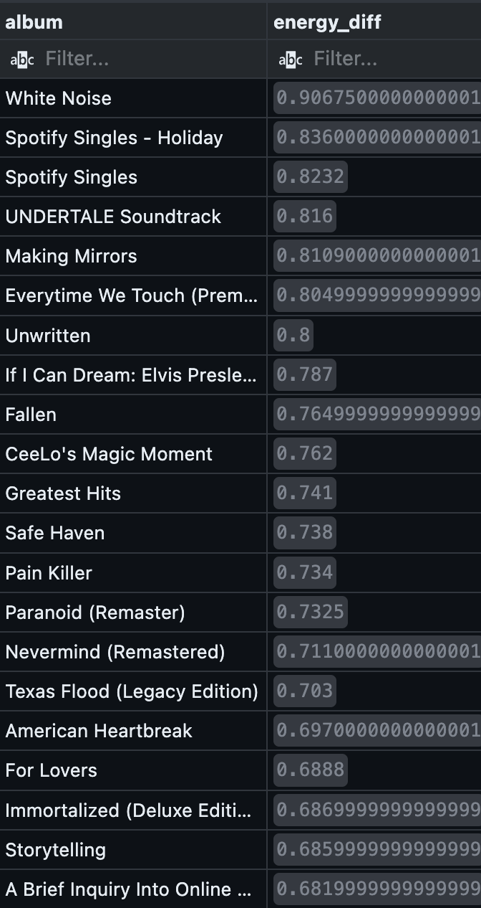
💡 **Insight**: Measures the variability in energy levels across the dataset.


## ⭐️ Key Insights
- Global Popularity Revealed: Multiple tracks exceeded one billion streams on Spotify, indicating massive global reach and audience engagement.
- Licensing and Engagement Go Hand in Hand: Licensed tracks tend to receive more user interaction (e.g., comments), suggesting that official releases are more trusted and promoted.
- Prolific Artists Identified: Certain artists contribute significantly more tracks to the platform, offering a strategic opportunity for label-focused marketing and promotion.
- Energy & Danceability = Popularity: Tracks with higher energy and danceability scores are consistently among the most streamed and viewed, making them ideal for upbeat playlists and social media use.
- Visual Content Drives Performance: Tracks with official videos not only have more visibility but also outperform in terms of views and likes, emphasizing the value of multimedia promotion.
- YouTube vs Spotify Trends: Some tracks perform better on Spotify than on YouTube, suggesting platform-specific audience preferences that can inform targeted advertising.
- Album-Level Trends: Aggregated album data (e.g., total views, average danceability) reveals performance at a higher level and can guide production and curation decisions.
- Live-Feeling Tracks Stand Out: Tracks with above-average liveness may cater to niche audiences that prefer the feel of live performances.
- Wide Variability in Track Energy: The range between the highest and lowest energy scores shows that the dataset includes a diverse mix of moods and styles—ideal for personalized playlists.


## 🧠 What I Have Learned
- Working on this project gave me hands-on experience with real-world data analysis tasks using SQL and PostgreSQL. Key learnings include:
- Data Modeling & Schema Design: I learned how to translate raw CSV data into a structured relational database, including setting up normalized tables and defining relationships.
- SQL Proficiency: I enhanced my ability to write efficient SQL queries to extract, aggregate, and analyze data—answering practical business questions using real data.
- Insight Generation: I practiced interpreting query results to generate actionable business insights, reinforcing the importance of storytelling in data analytics.
- Tool Integration: I gained experience working with PostgreSQL through pgAdmin for database management, and VSCode for scripting and development—tools I expect to use in a real analytics role.
- Attention to Data Quality: By cleaning and standardizing the dataset before analysis, I learned the importance of consistent formatting and validation for trustworthy insights.
- Portfolio & Communication Skills: This project helped me practice how to present data projects clearly and professionally in a portfolio, including documenting process, insights, and technical steps.


## 🙏 Acknowledgments
- Dataset creator: [Sanjana Chaudhari](https://www.kaggle.com/datasets/sanjanchaudhari/spotify-dataset)
- Inspired by real-world music analytics and data storytelling practices

---

## ⚖️ License
This project is open for educational and portfolio use.
